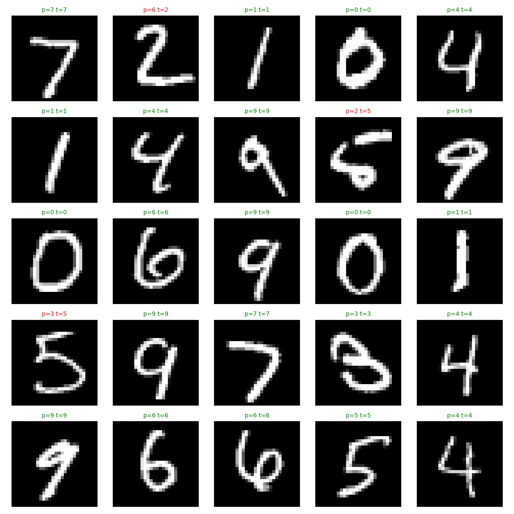
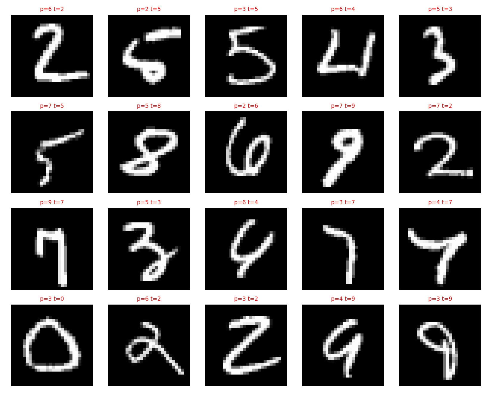
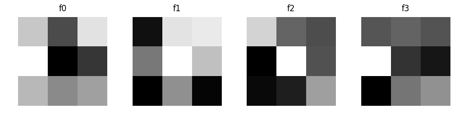
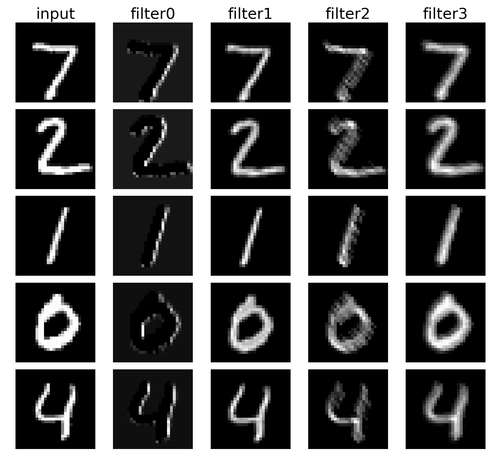

# Simple CNN

MNIST を対象としたシンプルな CNN の実装です．

畳み込み層と全結合層を同時に学習するシンプルな構成にしています．

## Tested environment

+ OS: Ubuntu 22.04 LTS
+ Python: 3.10.12
+ NumPy: 2.2.6
+ TensorFlow: 2.20.0
+ Matplotlib: 3.10.8

## Install & Run

```bash
git clone https://github.com/nacky823/simple_cnn.git
cd simple_cnn
```
```bash
python3 simple_cnn.py
```

## Example output

MNIST を読み込み学習し，各エポックの訓練データでの正解率と，テストデータでの正解率を出力します．

以下の出力例は，訓練に 1000 枚，テストに 200 枚の画像を使用した場合のものです．

```
MNIST loaded (NCHW):
  X_train: (60000, 1, 28, 28) float32 range (0.0, 1.0)
  y_train: (60000,) int64 labels (0, 9)
  X_test : (10000, 1, 28, 28) float32
  y_test : (10000,) int64
[verify] max|Y_np - Y_tf| = 4.76837e-07
[verify] OK (within tolerance)
epoch  1/5  last_loss 0.5570  train_acc 0.6800  test_acc 0.6300
epoch  2/5  last_loss 0.3515  train_acc 0.8760  test_acc 0.8050
epoch  3/5  last_loss 0.2569  train_acc 0.9050  test_acc 0.8650
epoch  4/5  last_loss 0.3854  train_acc 0.9350  test_acc 0.8750
epoch  5/5  last_loss 0.1842  train_acc 0.9480  test_acc 0.9000

Final (subset, trainable conv):
  train_acc: 0.948
  test_acc : 0.9
```

また、学習後に `outputs/` へ以下の可視化画像が出力されます．

### 1. 予測結果の例

テスト用の画像 200 枚のうち先頭 25 枚を縦横 5 枚づつ並べ，各画像の上に **予測ラベル（pred）** と **正解ラベル（true）** を表示します．

pred と true が一致する場合が正解であり，ラベルの色が緑なら正解，赤なら不正解を表します．



### 2. 誤分類の一覧

誤分類した画像をすべて集め，それぞれの予測ラベルと正解ラベルを表示します．

どの数字が間違えやすいか，どのような書き方が間違えやすいかなど，誤分類の傾向を確認できます．



### 3. フィルタの可視化

学習された畳み込みカーネル（フィルタ）をすべて表示します．

入力のどのような局所パターンに強く反応するフィルタが学習されたかを確認できます．



### 4. 特徴マップの可視化

入力画像と各フィルタの特徴マップ（filter0, filter1, ...）を横並びで表示します。

各フィルタが入力画像のどの位置のパターンに強く反応するかを確認できます。



## Model description

入力画像を $x \in \mathbb{R}^{1 \times 28 \times 28}$ とし，バッチサイズ $N$ の入力を
$X \in \mathbb{R}^{N \times 1 \times 28 \times 28}$ とする．
畳み込み層の重みとバイアスを $W_c, b_c$ とすると，特徴マップ上の位置 $(h, w)$ とフィルタ $f$ に対する畳み込みの出力は

$$
Z_c[n,f,h,w] =
\sum_{c}\sum_{i}\sum_{j}
W_c[f,c,i,j]\,
X_p[n,c,h\cdot s+i,\, w\cdot s+j] + b_c[f]
$$

と表せる． $f$ はフィルタ， $c$ は入力チャンネル， $(h,w)$ は特徴マップ上の位置， $(i,j)$ はカーネル内の位置， $X_p$ はパディング後の入力， $s$ はストライドである．

これに活性化関数として ReLU を適用する．

$$
A_c = \mathrm{ReLU}(Z_c)
$$

次に， $A_c$ を平坦化して特徴ベクトル $F$ を作り，全結合層でクラスごとのスコアを得る．

$$
F = \mathrm{flatten}(A_c), \quad Z = F W + b
$$

ソフトマックスで確率 $P$ を計算し，正解ラベル $Y$ との交差エントロピー損失

$$
P = \mathrm{softmax}(Z), \quad
\mathcal{L} = -\frac{1}{N}\sum_{i=1}^N \sum_{k=1}^K Y_{ik}\log(P_{ik})
$$

を最小化するように， $W_c, b_c, W, b$ を更新する．


## References

1. A. Krizhevsky, I. Sutskever, and G. E. Hinton, “ImageNet Classification with Deep Convolutional Neural Networks,” in *NIPS*, 2012.

1. TensorFlow Developers, “[tf.keras.datasets.mnist.load_data](www.tensorflow.org/api_docs/python/tf/keras/datasets/mnist/load_data),” TensorFlow API Documentation, (accessed 2026-01-23).

1. TensorFlow Developers, “[tf.nn.conv2d](www.tensorflow.org/api_docs/python/tf/nn/conv2d),” TensorFlow API Documentation, (accessed 2026-01-23).
